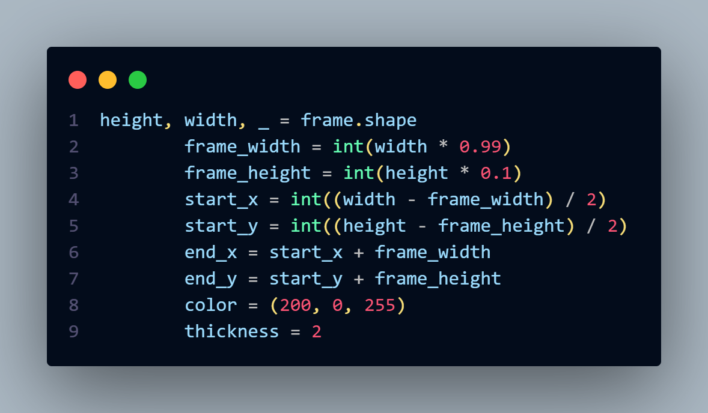
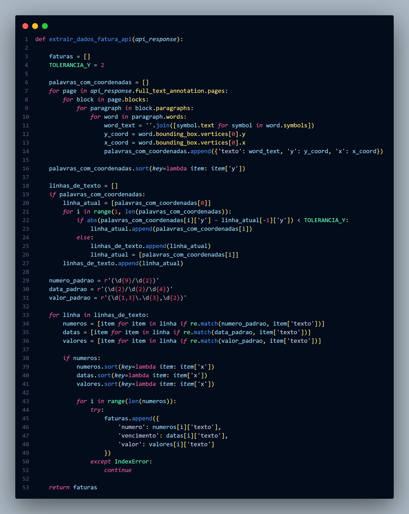

<h1> NF-e Scan </h1>

 <i>The following documentation was written in Portuguese 🇧🇷</i>
  <i>Try using the browser's translation.</i>

    <h2>SOBRE</h2>
    
 O NF-e Scan é uma solução para a automatização do processo de gerar um doccumento para histórico da nota fiscal da empresa. A princípio este projeto é voltado para a empresa que trabalho, porém pode ser adaptada para outras empresas(Pode ser aprimorado caso necessário para que seja definida para diversos estilos e configurações diferentes diferentes). Inicialmente o processo de arquivamento era feito a mão devido a distãncia do setor que envia as notas e o setor administrativo (onde trabalho), portanto propus que fosse feito a automatização do processo. O que acabou por gerar este projeto.  O projeto usa Visão Computacional por meio da biblioteca <a href="https://opencv.org/">OpenCV</a> para ler a imagem da nota fiscal e extraí-la os dados necessários para o documento. O Processo de análise e extração de dados é feito pela API do Google Colud Vision. E a geração do documento foi feita pela biblioteca <a href="https://python-docx.readthedocs.io/en/latest/">python-docx</a>. 

    

    <h2>ETAPA DE DESENVOLVIMENTO</h2>
    
 O projeto foi pensado em ser construído em 3 principais etapas:   
        <ol>
            <li> <strong>Reconhecimento da Nota Fiscal</strong> </li>
            <li> <strong>Extração de Dados</strong> </li>
            <li> <strong>Gerar Documento</strong> </li>
        </ol>
    

    

    <h3 align= 'center'>Θ RECONHECIMENTO E COMPUTER VISION Θ</h3>
    
Para utilizar a camera utilizei o <a href="https://droidcam.app/">Droidcam</a> onde utilizei a camera do celular para fazer a captura. Fiz um frame onde apenas o que está dentro dele seria contado para a analise dos dados.
    

    

    <h4> <u>FRAME</u>  </h4>
    
    <h4>CAPTURE WINDOW (exemple)</h4>
    
    

    <h3 align= 'center'>Θ EXTRAÇÃO DE DADOS Θ</h3>
    

    O processo de extração de dados foi um pouco complexa pois deveria corretamente identificar os dados necessários para o documento e na ordem correta. Comoé a minha primeira vez utilizando Visão computacional, pedi bastante ajuda para o Gemini. E cheguei em um resultado satisfatório. O processo de extração de dados foi feito pela API do Google Cloud Vision. 
    

    

    <h4 align = 'center'> LOGICA DE EXTRAÇÃO DE DADOS </h4>
    

    
    

    

    <h3 align = 'center'>Θ GERAR DOCUMENTO Θ</h3>
    
 O processo de geração do documento foi feito pela biblioteca python-docx, não houve algo tão complexo, a estrutura pode ser conferida no arquivo <i>Document_maneger.py</i>  

    <h2>PROBLEMAS ENCONTRADOS</h2>
    
O principal problema  que encontrei foi no passo de extração de dados, inicialmente eu estava usando a biblioteca <a href="https://pypi.org/project/pytesseract/">Pytesseract</a> entretanto pouco resultado estaja ocorrendo, quase não era possível extrair qualquer dado e quando algo era reconhecido era cheio de erros. Portanto, optei por usar a API do Google Cloud após conversas com colegas. 
    Após isto, não houve tantos problemas. Tentei implementar uma conversão de docx para pdf, porém a tentativa não teve êxito e como não havia uma necessidade desta conversão , optei por não implementar. 
    

    <h2>POSSÍVEIS MELHORIAS/ATUALIZAÇÕES</h2>
    
O projeto já está operacional, mas penso em fazer pequenas melhoria como:
    <ul>
        <li> Automatização do envio via whatssapp.
        <li> Possibilitar que o programa possa ser utilizado em qualquer máquina da empresa(no momento apenas minha máquina está sendo utilizada).
        <li> Criar uma versão mobile para que possa ser utilizado em qualquer lugar da empresa.
        <li> Separar a documentação em módulos. otimizando o entendimento e manutenção do código.
    </ul>
    

